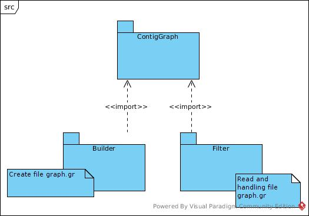
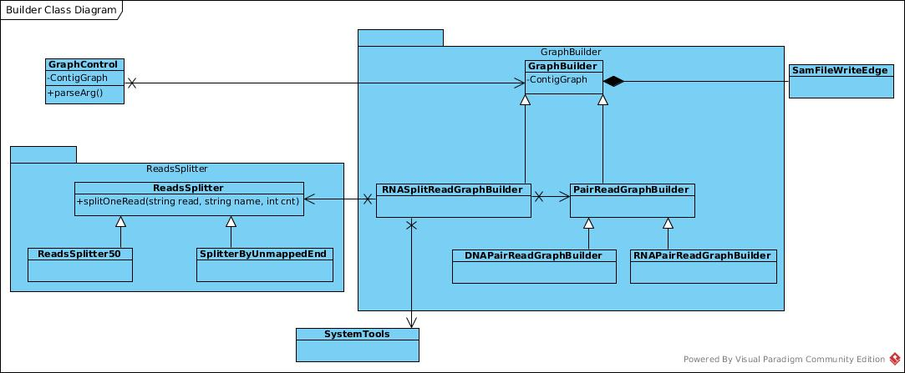

# Contig Graph
## Высокоуровневая архитектура:
Pipline cостит из двух независимых частей:
* Построние графа	
* Фильтрация графа

Результат работы первой части является файл с расширением .gr и 
втораяя часть соответственно обрабатывает данный файл. 

## Пакет ContigGraph
Отвечает за представление графа связий между контигами.
### Класс ContigGraph хранит в себе представление графа. 
   * Вершинами графа являются контиги. Хранится информация о длине и название контига. 
   * Граф может быть построен на основание нескольких библиотек. Хранятся имена библиотек и цвет, которым в будующем будет отражаться данная библиотека. 
   * Для ребер хранится библиотека, к которой это ребро относится и вес ребра.
   * newLib(name, color) - добавляет новую библиотеку с данным именем и цветом. 
   * getEdges(v) - возвращает все ребра, которые выходят из контига v
   * getEdgesR(v) - возвращает все ребра, которые входят в контиг v
   * getToVertex(e) - возвращает вершину в которую входит ребро e
   * getFromVertex(e) - возвращает вершину из которой выходит данное ребро e
   * getEdgeWeight(e) - возвращает вес ребра e
   * getEdgeLib(e) - возвращает библиотеку, которой принадлежит реберо
   * getLibColor(l) - возвращает цвет, в который будут окрашены ребра библиотеки
   * getLibName(l) - возвращает имя библиотеки 
   * incEdgeWeight(v, u) - увеличивает вес ребра из последней библиотеки между v и u.
   * addVertex(id, name, len) - добавляет новую вершину с данным именем и длинной. Так же указывается  предполагаемый id новой вершины. 
   * getTargetLength(id) - возвращает длину контига
   * getTargetName(id) - возвращает имя контига
   * getVertexCount() - возвращает количество вершин.
   * getLibNum() - возвращает количетсов библиотек
   * write(fileName) - сериализация файла в gr формат
   * read(fileName) - статическая функция, которая создает ContigGraph по gr файлу

### Описание gr формата
<количество библиотек - ln> далее идут ln строчек следующего типа:  
l <номер библиотеки> <цвет> <имя библиотеки>  
<количество вершин - vn> далее идут vn строчек следующего типа:  
v <номер вершины> <название контига> <длина контига>  
<количество ребер - en> далее идут en строчек следующего типа:  
e <номер ребра> <вершина, из которой исходит ребро> <вершина, в которую входит ребро> <библиатека, которой принадлежит ребро> <вес ребра>  
  
Везде требуется, что бы номер вершину/ребра/библиотеки совпадал с номером строчки в блоке  

Пример:  
2  
l 0 #67c669 lib1  
l 1 #ff0000 lib2  
3  
v 0 contig1 1051  
v 1 contig2 150  
v 2 contig3 3800  
2  
e 0 1 2 0 10  
e 0 2 1 1 15  

## Пакет Builder
### Архитектура
* Изначально управление передается GraphControl, который отвечает за парсинг аргументов и пониманет кому дальше передавать управление. 
* Имеется общий ContigGraph, который и будет строиться по ходу выполнения программы. 
* В зависимости от входных параметров GraphControl передает ContigGraph реализациям абстрактного класса GraphBuilder которые в 
свою очередь достраивают данный граф. Причем каждый следующий GraphBuilder не будет иметь право портить то, что сделал 
предыдущий GraphBuilder. 
* У каждого GraphBuilder имеется SamFileWriteEdge. Он отвечает 
за то, что бы в отдельной папочки для каждого ребра выводилась 
информация о ридах на основание которых данное ребро было проведено. 
* В местах, где используется SystemTools важно, что бы операционая система была Linux и что бы был установлен определенный soft. 

### ReadsSplitter
* Используется при построение связий между контигов по ридам РНК, одна часть которого попала на экзон, который находится на одном контиге, а вторая часть рида с экзона на другом контиге. 
Использутеся в классе RNASplitReadGraphBuilder.
* Занимается тем, что разрезает риды, которые полохо выранились на части. 
* ReadsSplitter50 - разрезает все риды пополам. Файл с ридами на входе должен быть в fasta/fastq формате.
* SplitterByUnmappedEnd - находит риды, которые выравнились не целиком, отрезает конец, который не выранивался из него создает отдельный рид. В этом случае файл с ридами должен быть в Sam/Bam формате.
* unordered_map<string, string> reads - по старому названию рида можно получить его значение.
* splitRead(string readName, string seq, string len, SeqFileOut& out1, SeqFileOut& out2) - разрезает один рид с данным именем и значением. Первая часть разрезанного рида будет иметь длину len, первая часть будет записана в out1 с именем readName+"/1", вторая - readName+"/2" в out2.
* splitReads(string rnaFileName, resFileName1, resFileName2) - 	разрезаем риды из rnaFileName, первые части ридов пойдут в файл resFileName1, вторые - resFileName2. Фыходные файлы в fasta/fastq формате. В зависимости от названия файлов. 
